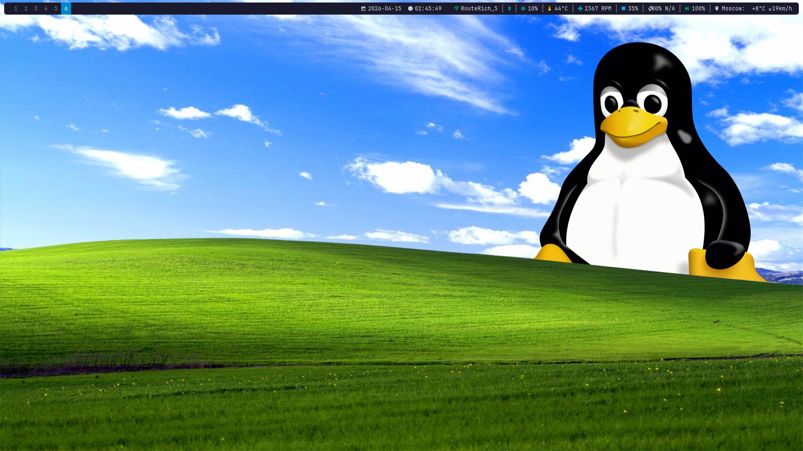
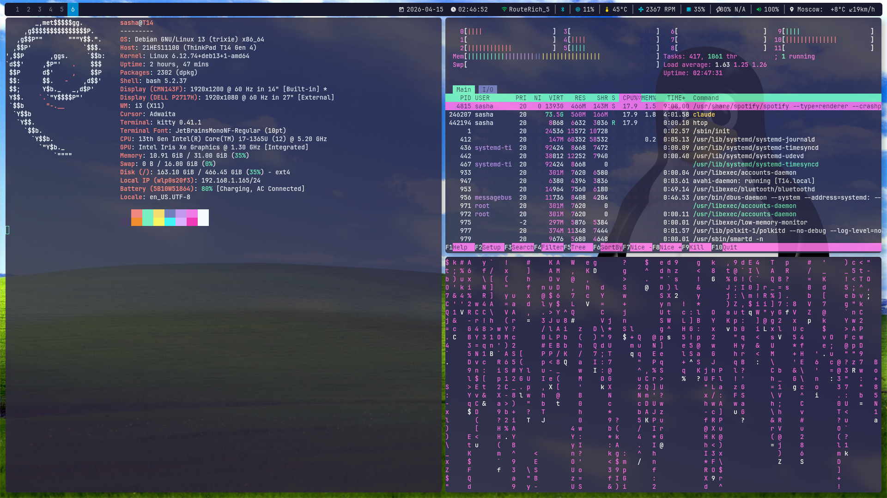

# Dotfiles

i3wm rice on Debian Trixie (ThinkPad T14)




## Stack

- **WM:** i3
- **Bar:** Polybar
- **Compositor:** Picom (shadows, fading, rounded corners)
- **Terminal:** Kitty
- **Launcher:** Rofi
- **Shell:** Zsh + Oh My Zsh + Powerlevel10k + fzf
- **Font:** JetBrainsMono Nerd Font
- **Wallpaper:** Custom Win XP / Linux mashup

## Polybar Modules

| Module | Description |
|--------|-------------|
| Network | Wi-Fi SSID via nmcli; left-click opens rofi network picker (`wifi-menu.sh`), right-click opens nm-connection-editor |
| Bluetooth | Status via bluetoothctl, click opens blueman-manager |
| CPU | Usage % |
| Temperature | Thermal zone with warning threshold |
| Fan | RPM from ThinkPad hwmon |
| Memory | RAM usage % |
| Battery | Charge %, state icon, time remaining |
| Volume | PulseAudio, click opens pavucontrol |
| Weather | wttr.in, city + temp + wind |

## Scripts

Distributed into `~/.local/bin/` by `install.sh`. Referenced from i3 and zshrc by that path.

| Script | Description |
|--------|-------------|
| `bat-lifetime.sh` | Battery status with dynamic Nerd Font icons |
| `bat-low-alert.sh` | Low battery notification |
| `bat-low-alert-keyboard.sh` | Bluetooth keyboard battery alert |
| `bat-low-alert-mouse.sh` | Bluetooth mouse battery alert |
| `fan-speed.sh` | ThinkPad fan RPM monitor |
| `get-my-weather.sh` | Weather via wttr.in |
| `hdmi-output.sh` | HDMI display auto-config + workspace migration |
| `connect-to-wifi.sh` | Interactive CLI wifi connect (alternative to polybar picker) |
| `vpn.sh` | Launch VPN client |
| `mount-external-hdd.sh` | Toggle LUKS-encrypted external drive (UUID from env) |
| `start-vms.sh` | Toggle libvirt VMs on i3 workspaces (names/workspaces from env) |
| `telega-update.sh` | Update Telegram Desktop |
| `py-venv.sh` | Create a Python venv in a given project dir |
| `kube-context.sh` / `kube-exec.sh` | Pick kube context / exec into a pod by prefix |
| `ssh-me.sh` | Pick from personal SSH-connection scripts (dir from env) |
| `ssh-proxy.sh` | Toggle SOCKS proxy over SSH (host/port from env) |
| `ssh-port-forward.sh` | Local port-forward `<user> <ip> <port>` |
| `back-me-up.sh` | Nightly config + encrypted-secrets backup |
| `ext-hhd-loca-bup.sh` | Full rsync snapshot of $HOME to external drive |
| `push-my-dir.sh` | Auto-commit + push a list of repos (from env) |
| `ssd-healthchecker.sh` | NVMe SMART watchdog with Telegram alerts |
| `pipewire-startup-recover.sh` | Restarts PipeWire after login only if startup left audio on `Dummy Output` |

Plus `polybar/wifi-menu.sh` — rofi-based wifi picker launched from the polybar Network module.

## Dependencies

```bash
sudo apt install i3 polybar picom kitty rofi feh flameshot \
    blueman network-manager brightnessctl pulseaudio-utils \
    fonts-jetbrains-mono fzf
```

## Install

```bash
git clone https://github.com/sasha-sup/dotfiles.git ~/Code/private/dotfiles
cd ~/Code/private/dotfiles
./install.sh
```

`install.sh` symlinks configs into `~/.config/...`, scripts into `~/.local/bin/`, user services into `~/.config/systemd/user/`, fonts into `~/.local/share/fonts/`, and sets up Oh My Zsh + Powerlevel10k.

The PipeWire startup recovery user service is enabled by `install.sh`; if user systemd is unavailable during install, rerun `systemctl --user enable pipewire-startup-recover.service` after login.

## Personal values (`~/.config/dotfiles.env`)

Anything host-, hardware-, or identity-specific (VPS host/port, LUKS UUID, VM names, GPG email, private repo paths, device names for the SSD watchdog, Telegram notify env file) lives in `~/.config/dotfiles.env`. That file is `chmod 600`, **not** tracked by git, and included in the GPG-encrypted backup produced by `back-me-up.sh`.

Scripts load it via:

```bash
. "${DOTFILES_ENV:-$HOME/.config/dotfiles.env}" 2>/dev/null || true
```

and require vars with `:?` so missing values fail loudly:

```bash
SSH_HOST="${SSH_PROXY_HOST:?SSH_PROXY_HOST not set (see ~/.config/dotfiles.env)}"
```

Start from `scripts/dotfiles.env.example` — copy it to `~/.config/dotfiles.env` and uncomment only the blocks you need.

## Extending

### Adding a new script

1. Drop the file in `scripts/`, `chmod +x`.
2. Run `./install.sh` to symlink it into `~/.local/bin/`.
3. (Optional) add an `exec_always $HOME/.local/bin/<name>.sh` line to `i3/config`, or an alias to `zsh/zshrc` using `$SCRIPTS_BASE`.
4. If it needs personal data:
   - Source the env as shown above.
   - Add a commented template block to `scripts/dotfiles.env.example`.
   - Set the real value in `~/.config/dotfiles.env`.

### Adding a file/directory to backup

Edit `scripts/back-me-up.sh`:

- **Plaintext** (rotated 3 days) → add to the `CONFIG_FILES` associative array:
  ```bash
  ["/path/to/thing"]="thing_name"
  ```
- **GPG-encrypted** (rotated 14 days, to `aleksandrsuprun862@gmail.com`) → add an `encrypt_dir` call:
  ```bash
  encrypt_dir "$HOME/path/to/secret" "short_name"
  ```

Cron runs the backup daily at 11:12. After it finishes, `push-my-dir.sh` pushes the repos listed in `PUSH_TARGET_DIRS` (env), so the encrypted bundle lands on private GitHub.

## Repo hygiene

- `~/.config/dotfiles.env` — private, never commit.
- `scripts/dotfiles.env.example` — public template, safe to commit.
- Do not hardcode: IPs, hostnames, usernames, emails, UUIDs, VM names, port numbers for personal servers, private repo paths. Put them in the env file.

## Structure

```
dotfiles/
├── i3/config
├── polybar/
│   ├── config.ini
│   ├── launch.sh
│   └── wifi-menu.sh        # rofi wifi picker (polybar click-left)
├── picom/picom.conf
├── kitty/kitty.conf
├── zsh/
│   ├── zshrc
│   └── p10k.zsh
├── scripts/
│   ├── dotfiles.env.example  # template for ~/.config/dotfiles.env
│   ├── *.sh                  # symlinked into ~/.local/bin/
├── fonts/                   # Powerlevel10k MesloLGS
├── wallpapers/
├── install.sh
└── README.md
```
