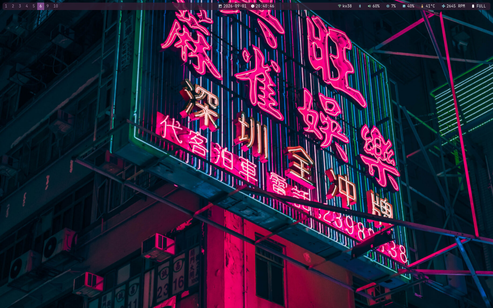
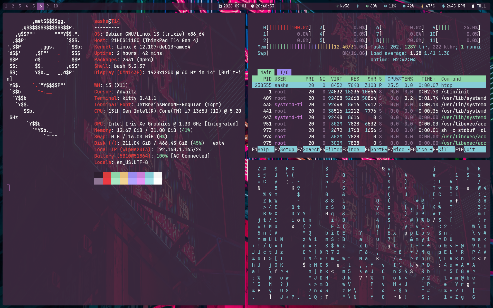

# Dotfiles

i3wm rice on Debian Trixie (ThinkPad T14)




## Stack

- **WM:** i3
- **Bar:** Polybar
- **Compositor:** Picom (shadows, fading, rounded corners)
- **Terminal:** Kitty
- **Launcher:** Rofi
- **Shell:** Zsh + Oh My Zsh + Powerlevel10k + fzf
- **Font:** JetBrainsMono Nerd Font
- **Emoji:** Noto Color Emoji via fontconfig fallback
- **Wallpaper:** Neon shopfront shot (`wallpapers/1zvHQuC4.png`)

## Polybar Modules

| Module | Description |
|--------|-------------|
| Network | Wi-Fi SSID via nmcli; left-click opens rofi network picker (`wifi-menu.sh`), right-click opens nm-connection-editor |
| Bluetooth | Status via bluetoothctl, click opens blueman-manager |
| CPU | Usage % |
| Temperature | Thermal zone with warning threshold |
| Fan | RPM from ThinkPad hwmon |
| Memory | RAM usage % |
| Battery | Charge %, state icon, time remaining |
| Volume | PulseAudio, click opens pavucontrol |
| Weather | wttr.in, city + temp + wind |

## Scripts

Distributed into `~/.local/bin/` by `install.sh`. Referenced from i3 and zshrc by that path.

| Script | Description |
|--------|-------------|
| `bat-lifetime.sh` | Battery status with dynamic Nerd Font icons |
| `bat-low-alert.sh` | Low battery notification |
| `bat-low-alert-keyboard.sh` | Bluetooth keyboard battery alert |
| `bat-low-alert-mouse.sh` | Bluetooth mouse battery alert |
| `fan-speed.sh` | ThinkPad fan RPM monitor |
| `get-my-weather.sh` | Weather via wttr.in |
| `hdmi-output.sh` | HDMI display auto-config + workspace migration |
| `connect-to-wifi.sh` | Interactive CLI wifi connect (alternative to polybar picker) |
| `vpn.sh` | Launch VPN client |
| `mount-external-hdd.sh` | Toggle LUKS-encrypted external drive (UUID from env) |
| `start-vms.sh` | Toggle libvirt VMs on one tabbed i3 workspace (names/workspace from env) |
| `telega-update.sh` | Update Telegram Desktop |
| `ledger-install.sh` | Install/update Ledger Live Desktop AppImage into `~/.local/bin/` (sha512-verified against the official feed) |
| `py-venv.sh` | Create a Python venv in a given project dir |
| `kube-context.sh` / `kube-exec.sh` | Pick kube context / exec into a pod by prefix |
| `ssh-me.sh` | Pick from personal SSH-connection scripts (dir from env) |
| `ssh-proxy.sh` | Toggle SOCKS proxy over SSH (host/port from env) |
| `ssh-port-forward.sh` | Local port-forward `<user> <ip> <port>` |
| `back-me-up.sh` | Nightly config + encrypted-secrets backup |
| `ext-hhd-loca-bup.sh` | Full rsync snapshot of $HOME to external drive |
| `push-my-dir.sh` | Auto-commit + push a list of repos (from env) |
| `ssd-healthchecker.sh` | NVMe SMART watchdog with Telegram alerts |
| `pipewire-startup-recover.sh` | Restarts PipeWire after login only if startup left audio on `Dummy Output` |
| `dotfiles-version.sh` | Switch the rice between tagged versions and reload the desktop (see [Versions](#versions)) |

Plus `polybar/wifi-menu.sh` — rofi-based wifi picker launched from the polybar Network module.

## Dependencies

```bash
sudo apt install i3 polybar picom kitty rofi feh flameshot \
    blueman network-manager brightnessctl pulseaudio-utils \
    fonts-jetbrains-mono fonts-noto-color-emoji fzf
```

## Install

```bash
git clone https://github.com/sasha-sup/dotfiles.git ~/Code/private/dotfiles
cd ~/Code/private/dotfiles
./install.sh
```

`install.sh` symlinks configs into `~/.config/...`, scripts into `~/.local/bin/`, user services into `~/.config/systemd/user/`, fontconfig emoji fallback into `~/.config/fontconfig/conf.d/`, fonts into `~/.local/share/fonts/`, desktop entries into `~/.local/share/applications/` with icons into `~/.local/share/icons/hicolor/`, and sets up Oh My Zsh + Powerlevel10k.

### Symlinks, not copies

Every tracked file is symlinked into place, so the live config and the repo are always the same file — editing either one edits both, and `git status` shows every local change. Three deliberate exceptions:

- `applications/*.desktop` is generated with `sed`, because `Exec=` needs an absolute path that cannot be hardcoded in the repo.
- Files holding personal data are never tracked and never symlinked: `~/.config/dotfiles.env` and `~/.zshrc.local` are seeded once from a template and then left alone.
- `scripts/dotfiles-version.sh` is copied, with `@DOTFILES_DIR@` expanded to the repo path. It has to survive `switch` onto a version older than itself, where a symlink would dangle and leave no way to run `back`. Because it is a copy, rerun `./install.sh` after editing it.

If a real file already exists where a symlink should go, `install.sh` moves it to `<file>.bak-<timestamp>` instead of deleting it, then links. Rerunning the script is safe and idempotent.

The PipeWire startup recovery user service is enabled by `install.sh`; if user systemd is unavailable during install, rerun `systemctl --user enable pipewire-startup-recover.service` after login.

## Versions

Each look is a git tag, described in [CHANGELOG.md](CHANGELOG.md). Because every tracked file is
symlinked, checking out a tag rewrites the live config in place — nothing is reinstalled, only the
running programs are reloaded. `dotfiles-version.sh` does both:

```bash
dotfiles-version.sh list                 # every version, * marks the checked-out one
dotfiles-version.sh switch v1.0.0        # roll the whole rice back and reload the desktop
dotfiles-version.sh back                 # return to master
dotfiles-version.sh release v2.1.0 "..." # write the changelog section and tag this commit
```

`switch` leaves the repo in detached HEAD, so it refuses to run while anything is uncommitted —
commit or `git stash` first, and use `back` when you are done looking.

`release` collects the commit subjects since the previous tag into a new `CHANGELOG.md` section,
commits it, and creates the annotated tag. Push it afterwards:

```bash
git push origin master && git push origin v2.1.0
```

Numbering: bump the major for a new look (different wallpaper, palette or bar layout), the minor for
added config or scripts, the patch for fixes.

## Personal values (`~/.config/dotfiles.env`)

Anything host-, hardware-, or identity-specific (VPS host/port, LUKS UUID, VM names, GPG email, private repo paths, device names for the SSD watchdog, Telegram notify env file) lives in `~/.config/dotfiles.env`. That file is `chmod 600`, **not** tracked by git, and included in the GPG-encrypted backup produced by `back-me-up.sh`.

Scripts load it via:

```bash
. "${DOTFILES_ENV:-$HOME/.config/dotfiles.env}" 2>/dev/null || true
```

and require vars with `:?` so missing values fail loudly:

```bash
SSH_HOST="${SSH_PROXY_HOST:?SSH_PROXY_HOST not set (see ~/.config/dotfiles.env)}"
```

`install.sh` seeds `~/.config/dotfiles.env` from `scripts/dotfiles.env.example` on first run and never overwrites it afterwards — uncomment only the blocks you need.

## Machine-local shell config (`~/.zshrc.local`)

`zsh/zshrc` is shared across machines, so anything personal — internal IPs, host aliases, per-machine paths — goes into `~/.zshrc.local`, which is sourced at the end of `zshrc` and is neither tracked nor symlinked. `install.sh` creates an empty one if it is missing.

## Extending

### Adding a new script

1. Drop the file in `scripts/`, `chmod +x`.
2. Run `./install.sh` to symlink it into `~/.local/bin/`.
3. (Optional) add an `exec_always $HOME/.local/bin/<name>.sh` line to `i3/config`, or an alias to `zsh/zshrc` using `$SCRIPTS_BASE`.
4. If it needs personal data:
   - Source the env as shown above.
   - Add a commented template block to `scripts/dotfiles.env.example`.
   - Set the real value in `~/.config/dotfiles.env`.

### Adding an AppImage app to the rofi launcher

`Alt+D` runs `rofi -show drun`, which only lists `.desktop` entries — an executable in `PATH` is not enough.

1. Extract the bundled entry and icons from the AppImage:
   ```bash
   ./TheApp.AppImage --appimage-extract '*.desktop'
   ./TheApp.AppImage --appimage-extract 'usr/share/icons/*'
   ```
2. Put the entry in `applications/<name>.desktop.in`, with `Exec=@HOME@/.local/bin/<name> ... %U`.
   Never hardcode `/home/<user>` — `install.sh` expands `@HOME@`.
3. Copy the PNGs to `icons/hicolor/<size>/apps/`.
4. Add the `link` loop and, if the binary should be auto-installed, an installer call to the
   "Desktop entries + icons" section of `install.sh`.

Install the AppImage into `~/.local/bin/`, **not** `/usr/local/bin/`. Electron's built-in updater
replaces the AppImage in place, which needs write access to the containing directory; a root-owned
directory makes every self-update fail with `EACCES: permission denied, unlink`.

### Adding a file/directory to backup

Edit `scripts/back-me-up.sh`:

- **Plaintext** (rotated 3 days) → add to the `CONFIG_FILES` associative array:
  ```bash
  ["/path/to/thing"]="thing_name"
  ```
- **GPG-encrypted** (rotated 14 days, to `aleksandrsuprun862@gmail.com`) → add an `encrypt_dir` call:
  ```bash
  encrypt_dir "$HOME/path/to/secret" "short_name"
  ```

Cron runs the backup daily at 11:12. After it finishes, `push-my-dir.sh` pushes the repos listed in `PUSH_TARGET_DIRS` (env), so the encrypted bundle lands on private GitHub.

## Repo hygiene

- `~/.config/dotfiles.env` — private, never commit.
- `~/.zshrc.local` — private, never commit.
- `scripts/dotfiles.env.example` — public template, safe to commit.
- Do not hardcode: IPs, hostnames, usernames, emails, UUIDs, VM names, port numbers for personal servers, private repo paths. Put them in the env file.

## Structure

```
dotfiles/
├── i3/config
├── polybar/
│   ├── config.ini
│   ├── launch.sh
│   └── wifi-menu.sh        # rofi wifi picker (polybar click-left)
├── picom/picom.conf
├── kitty/kitty.conf
├── zsh/
│   ├── zshrc
│   └── p10k.zsh
├── fontconfig/
│   └── conf.d/
│       └── 01-prefer-color-emoji.conf
├── scripts/
│   ├── dotfiles.env.example  # template for ~/.config/dotfiles.env
│   ├── *.sh                  # symlinked into ~/.local/bin/
├── applications/
│   └── *.desktop.in         # @HOME@ expanded into ~/.local/share/applications/
├── icons/hicolor/           # app icons, symlinked into ~/.local/share/icons/hicolor/
├── fonts/                   # Powerlevel10k MesloLGS, symlinked into ~/.local/share/fonts/
├── wallpapers/
├── screenshots/
│   └── take-rice-screenshot.sh  # regenerates clean.png and busy.png
├── install.sh
├── CHANGELOG.md             # one section per tagged version
├── AGENTS.md                # working notes for coding agents
└── README.md
```
